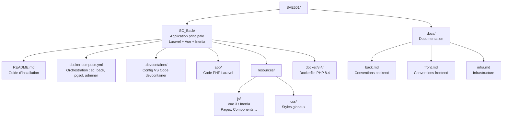

# Installation — SAE501

> **Environnement de développement local** — voir la section [Déploiement en production](#déploiement-en-production) avant toute mise en ligne.

Prérequis à installer **sur la machine hôte** avant d'ouvrir le projet dans un devcontainer VS Code.

---

## Déploiement en production

Variables `.env` **obligatoirement** à modifier avant toute mise en ligne :

| Variable | Valeur dev (à changer) | Recommandation prod |
|---|---|---|
| `APP_ENV` | `local` | `production` |
| `APP_DEBUG` | `true` | `false` — expose stacktraces et données sensibles si laissé à `true` |
| `APP_URL` | `http://localhost:8000` | URL publique avec HTTPS |
| `DB_DATABASE` | `sc_back` | Nom de base spécifique |
| `DB_USERNAME` | `sail` | Utilisateur dédié sans droits superuser |
| `DB_PASSWORD` | `password` | Mot de passe fort (min. 20 caractères, aléatoire) |
| `LOG_LEVEL` | `debug` | `error` |

Commandes à exécuter après déploiement :

```bash
php artisan key:generate
php artisan migrate --force
php artisan config:cache
php artisan route:cache
php artisan view:cache
```

> `php artisan migrate --force` bypass la confirmation interactive — ne jamais exécuter sur une base de production sans sauvegarde préalable.

---

## 0. Installation de WSL (Windows uniquement)

### Activer WSL

Dans un terminal PowerShell **en administrateur** :

```powershell
wsl --install
```

Redémarre la machine si demandé, puis installe une distro Ubuntu :

```powershell
wsl --install -d Ubuntu-24.04
```

Au premier lancement, WSL demande de créer un utilisateur Linux (nom + mot de passe).

Vérifier que la distro est bien active :

```powershell
wsl --list --running
```

### Configurer Git dans WSL

```bash
git config --global user.name "Prénom Nom"
git config --global user.email "ton@email.com"
```

### Configurer SSH pour GitHub

Générer une clé SSH (laisser la passphrase vide en appuyant sur Entrée) :

```bash
ssh-keygen -t ed25519 -C "ton@email.com"
```

Afficher la clé publique :

```bash
cat ~/.ssh/id_ed25519.pub
```

Copier la clé affichée, puis sur GitHub : **Settings → SSH and GPG keys → New SSH key** → coller et sauvegarder.

Tester la connexion :

```bash
ssh -T git@github.com
```

> La réponse attendue est `Hi <username>! You've successfully authenticated`.

### Activer le SSH agent au démarrage de WSL

Le devcontainer forward le socket SSH de l'hôte pour permettre `git push` depuis l'intérieur du container. L'agent doit être actif **avant** d'ouvrir le devcontainer.

Ajouter à la fin de `~/.bashrc` (ou `~/.zshrc`) sur WSL :

```bash
# SSH agent — démarrage automatique
if [ -z "$SSH_AUTH_SOCK" ]; then
    eval $(ssh-agent -s) > /dev/null
    ssh-add ~/.ssh/id_ed25519 2>/dev/null
fi
```

Recharger le shell :

```bash
source ~/.bashrc
```

Vérifier que la clé est bien chargée :

```bash
ssh-add -l
```

> Si `SSH_AUTH_SOCK` n'est pas défini au moment d'ouvrir le devcontainer, `git push` depuis le container échouera. Pusher depuis WSL reste toujours possible en secours.

### Cloner le projet

```bash
cd ~
git clone git@github.com:<org>/SC_Back.git
cd SC_Back
```

---

## 1. Logiciels requis

| Outil | Version minimale | Lien |
|---|---|---|
| Docker Desktop | 4.x | https://www.docker.com/products/docker-desktop |
| VS Code | 1.85+ | https://code.visualstudio.com |
| Git | 2.x | https://git-scm.com |

---

## 2. Configuration Docker Desktop (WSL)

Sous Windows avec WSL 2, Docker Desktop ne communique pas automatiquement avec toutes les distros WSL.

Activer l'intégration : **Docker Desktop** → **Settings** → **Resources** → **WSL Integration** (sous-onglet dans Resources) → cocher la distro cible (ex. `Ubuntu-24.04`).

Sans cette étape, toute commande `docker` depuis WSL retourne `Cannot connect to the Docker daemon`.

---

## 3. Extensions VS Code hôte (obligatoires)

Extensions permettant à VS Code de se connecter aux conteneurs et environnements distants.
Installation impossible via `devcontainer.json` — procéder manuellement :

```bash
code --install-extension ms-vscode-remote.remote-containers
code --install-extension ms-vscode-remote.remote-ssh
code --install-extension ms-vscode-remote.remote-wsl
code --install-extension ms-vscode.remote-explorer
code --install-extension ms-azuretools.vscode-docker
```

> **Pourquoi ces extensions sont hôte-only ?**
> Remote SSH et Remote WSL servent de pont entre VS Code (Windows) et l'environnement
> cible (serveur SSH ou noyau Linux WSL). Le devcontainer s'exécute à l'intérieur de cet
> environnement — ces extensions doivent être présentes sur la machine hôte, pas dans le conteneur.

---

## 4. Démarrer l'environnement de développement

### Première utilisation

```bash
cd SC_Back
cp .env.example .env
```

Renseigner les variables dans le `.env` :
- `WWWUSER` / `WWWGROUP` — UID/GID de la machine hôte (`id -u` et `id -g`)
- `DB_DATABASE`, `DB_USERNAME`, `DB_PASSWORD` — credentials PostgreSQL

> Le `.env` doit être présent avant d'ouvrir le devcontainer — VS Code démarre les containers Docker automatiquement via `docker-compose.yml` au "Reopen in Container".

> Valeurs requises pour la construction de l'image avec l'utilisateur `sail` correspondant à l'utilisateur hôte. Sans ces valeurs, le build échoue.

Dans VS Code : `Ctrl+Shift+P` → **Dev Containers: Reopen in Container**

Le devcontainer installe automatiquement les dépendances Composer et npm, génère la clé d'application, exécute les migrations et démarre `artisan serve`.

> Laravel ne répond pas immédiatement à l'ouverture du container — le serveur attend la fin de `composer install` avant de démarrer. Le port 8000 devient disponible automatiquement, aucune action manuelle requise.

Vite n'est pas démarré automatiquement — le lancer manuellement une fois dans le container (voir section suivante).

### Démarrer Vite (HMR)

Une fois dans le devcontainer :

```bash
npm run dev
```

### Ports exposés

| Port | Service | URL |
|---|---|---|
| `8000` | Laravel | http://localhost:8000 |
| `5173` | Vite HMR | http://localhost:5173 |
| `5432` | PostgreSQL | — |
| `8080` | Adminer | http://localhost:8080 |

### Connexion Adminer

> Adminer sélectionne `MySQL` par défaut — bien changer le **moteur** en `PostgreSQL` avant de se connecter.

- **Moteur** : `PostgreSQL` *(menu déroulant en haut)*
- **Serveur** : `pgsql`
- **Utilisateur** : valeur de `DB_USERNAME` dans `.env`
- **Mot de passe** : valeur de `DB_PASSWORD` dans `.env`
- **Base de données** : valeur de `DB_DATABASE` dans `.env`

---

## 5. Dépannage

### `Could not resolve host: deb.nodesource.com` lors du build Docker

Problème DNS dans le réseau Docker (fréquent sous WSL2). Créer le fichier de config Docker avec un DNS public :

```bash
sudo mkdir -p /etc/docker
echo '{"dns": ["8.8.8.8", "8.8.4.4"]}' | sudo tee /etc/docker/daemon.json
sudo service docker restart
```

### `vite: Permission denied` lors du build

Les symlinks dans `node_modules/.bin/` perdent leurs permissions d'exécution sur volumes WSL. Le `setup.sh` corrige automatiquement ce problème via `chmod +x node_modules/.bin/*`.

### Rebuild du devcontainer

Certains fichiers sont copiés dans l'image Docker au moment du build et ne sont **pas** mis à jour par le volume monté. Tout changement sur ces fichiers nécessite un rebuild :

| Fichier modifié | Action requise |
|---|---|
| `docker/8.4/Dockerfile` | Rebuild sans cache |
| `supervisord.conf` | Rebuild (avec ou sans cache) |
| `docker-compose.yml` | Rebuild |
| `.devcontainer/devcontainer.json` | Rebuild |
| `start-container`, `php.ini` | Rebuild |

**Rebuild avec cache** (rapide — réutilise les couches Docker non modifiées) :

`Ctrl+Shift+P` → **Dev Containers: Rebuild Container**

**Rebuild sans cache** (complet — re-télécharge tout, à utiliser si le cache pose problème) :

`Ctrl+Shift+P` → **Dev Containers: Rebuild Without Cache and Reopen in Container**

Ou depuis le terminal WSL avant d'ouvrir VS Code :

```bash
docker compose build --no-cache
```

---

## 6. Structure du projet

