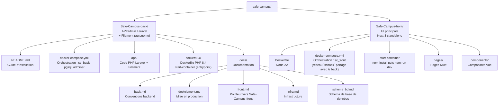

# Installation — SAE501

Environnement de développement local. Le code s'édite sur l'hôte (WSL), toutes les commandes PHP/Composer/Artisan s'exécutent dans le container.

---

## 0. Installation de WSL (Windows uniquement)

### Activer WSL

Dans un terminal PowerShell **en administrateur** :

```powershell
wsl --install
```

Redémarre la machine si demandé, puis installe une distro Ubuntu :

```powershell
wsl --install -d Ubuntu-24.04
```

Au premier lancement, WSL demande de créer un utilisateur Linux (nom + mot de passe).

Vérifier que la distro est bien active :

```powershell
wsl --list --running
```

### Configurer Git dans WSL

```bash
git config --global user.name "Prénom Nom"
git config --global user.email "ton@email.com"
```

Git s'utilise depuis WSL, à l'extérieur des containers.

### Configurer SSH pour GitHub

Générer une clé SSH (laisser la passphrase vide en appuyant sur Entrée) :

```bash
ssh-keygen -t ed25519 -C "ton@email.com"
```

Afficher la clé publique :

```bash
cat ~/.ssh/id_ed25519.pub
```

Copier la clé affichée, puis sur GitHub : **Settings → SSH and GPG keys → New SSH key** → coller et sauvegarder.

Tester la connexion :

```bash
ssh -T git@github.com
```

> La réponse attendue est `Hi <username>! You've successfully authenticated`.

### Cloner les deux dépôts

Chaque repo a son propre `docker-compose.yml` et se lance indépendamment. Les cloner dans un dossier parent commun reste conseillé pour s'y retrouver, mais ce n'est plus une contrainte technique.

```bash
mkdir -p ~/workspace/safe-campus && cd ~/workspace/safe-campus
git clone git@github.com:<org>/Safe-Campus-back.git
git clone git@github.com:<org>/Safe-Campus-front.git
```

---

## 1. Logiciels requis

| Outil | Version minimale | Lien |
|---|---|---|
| Docker Desktop | 4.x | https://www.docker.com/products/docker-desktop |
| VS Code | 1.85+ | https://code.visualstudio.com |
| Git | 2.x | https://git-scm.com |

---

## 2. Configuration Docker Desktop (WSL)

Sous Windows avec WSL 2, Docker Desktop ne communique pas automatiquement avec toutes les distros WSL.

Activer l'intégration : **Docker Desktop** → **Settings** → **Resources** → **WSL Integration** (sous-onglet dans Resources) → cocher la distro cible (ex. `Ubuntu-24.04`).

Sans cette étape, toute commande `docker` depuis WSL retourne `Cannot connect to the Docker daemon`.

---

## 3. Extensions VS Code

Le projet s'ouvre dans WSL. Extensions nécessaires côté hôte Windows :

```bash
code --install-extension ms-vscode-remote.remote-wsl
code --install-extension ms-azuretools.vscode-docker
```

> Remote WSL sert de pont entre VS Code (Windows) et le noyau Linux WSL où vit le code.
> Ouvrir le dossier via `code .` depuis un terminal WSL, ou `Ctrl+Shift+P` → **WSL: Open Folder in WSL**.

Extensions PHP/Laravel, installées côté WSL :

```bash
code --install-extension bmewburn.vscode-intelephense-client
code --install-extension xdebug.php-debug
code --install-extension onecentlin.laravel5-snippets
code --install-extension amiralizadeh9480.laravel-extra-intellisense
code --install-extension alperenersoy.filament-snippets
code --install-extension cweijan.vscode-postgresql-client2
code --install-extension mikestead.dotenv
```

> Intelephense analyse le code depuis l'hôte : il lit `vendor/`, écrit dans le bind mount par `composer install`.

---

## 4. Démarrer l'environnement de développement

```bash
cd Safe-Campus-back
cp .env.example .env
sed -i "s/^WWWUSER=.*/WWWUSER=$(id -u)/" .env
sed -i "s/^WWWGROUP=.*/WWWGROUP=$(id -g)/" .env

docker compose up -d

docker compose exec sc_back php artisan key:generate
docker compose exec sc_back php artisan migrate
docker compose exec sc_back php artisan db:seed
docker compose exec sc_back php artisan storage:link
```

Le `.env` est lu par Docker avant le build : `WWWUSER`/`WWWGROUP` créent l'utilisateur `scback` aligné sur l'utilisateur hôte, `DB_*` alimente PostgreSQL.

`SC_Back` exécute `composer install` à chaque démarrage, puis `artisan serve`. `key:generate`, `migrate` et `db:seed` sont à la main : l'état de la base est piloté par le dev.

> `migrate` seed automatiquement la taxonomie (themes/sous-themes) et le compte webmaster de démo — donnée structurelle requise par l'app. `db:seed` reste nécessaire à part pour l'annuaire de contacts et les médias (`ContactSeeder`, `MediaSeeder`) : volontairement pas dans une migration, pour ne pas polluer la base de test (`RefreshDatabase`) utilisée par la suite de tests, qui crée des contacts avec des `ref` réels (`samu`, `sos_ecoute`, ...). Les deux seeders sont idempotents (rejouables sans dupliquer).

> `storage:link` crée `public/storage` → `storage/app/public` (symlink, gitignoré). Sans ça, les fichiers uploadés via Filament (médias : images, PDF, ...) sont bien enregistrés mais renvoient 404 côté front.

| Conteneur | Rôle | Stack |
|---|---|---|
| `SC_Back` | Laravel (PHP 8.4) | ce repo |
| `SC_Postgres` | PostgreSQL 17 | ce repo |
| `SC_Adminer` | Interface DB | ce repo |
| `SC_Front` | Nuxt 3 + Vite HMR | [Safe-Campus-front](../Safe-Campus-front) |

Ouvrir le code : `code .` depuis WSL, à la racine du repo.

### Exécuter les commandes dans le container

Le shell hôte n'a ni PHP ni Composer. Toutes les commandes passent par `docker compose exec` :

```bash
docker compose exec sc_back php artisan migrate
```

Ou un shell interactif dans le container :

```bash
docker compose exec sc_back bash
```

Alias pratique à ajouter dans `~/.bashrc` sur WSL :

```bash
alias sc='docker compose exec sc_back'
# usage : sc php artisan migrate
```

> ⚠️ Ne pas relancer `php artisan serve` ni `composer dev` via `exec` : le container sert **déjà** sur le port 8000, le bind échouera.

### Logs

```bash
docker compose logs -f sc_back                                  # sortie du container
docker compose exec sc_back tail -f storage/logs/laravel.log    # log applicatif Laravel
```

### Rebuild de l'image

`docker/8.4/Dockerfile`, `php.ini` et `start-container` sont intégrés à l'image au build. Les modifier impose un rebuild :

```bash
docker compose build sc_back
docker compose up -d
```

Le reste du code vit dans le bind mount et ne nécessite aucun rebuild.

### Le front

`sc_front` a son propre `docker-compose.yml` dans [Safe-Campus-front](../Safe-Campus-front) — stack indépendante, à démarrer séparément (`cd ../Safe-Campus-front && docker compose up -d`). Les deux stacks partagent le réseau Docker `scback` (nom fixe) : si les deux tournent, `sc_front` joint `sc_back` par son nom de conteneur pour le SSR ; sinon `sc_back` reste simplement injoignable depuis le front. Le code du front s'édite dans ce repo, ses commandes passent par `docker compose exec sc_front` (depuis `Safe-Campus-front`).

### Fichiers médias (images, PDF, ...)

Uploadés depuis le panel Filament (ressource **Médias**), stockés sur le disque `public` (`config/filesystems.php`), sous `storage/app/public/medias/{type}/` — un sous-dossier par valeur de `App\Enums\MediaType`, pour mimer la colonne `type` de la table `medias` :

```
storage/app/public/medias/
├── image/
├── video/
├── audio/
└── document/     ← PDF (fiches ressources)
```

Aucun nouveau volume Docker : `sc_back` bind-mount déjà tout le repo (`.:/var/www/html`), `storage/` persiste comme le reste du code. Un volume nommé ne sera à envisager que pour une éventuelle stack de prod sans bind mount (pas encore définie, voir [docs/deploiement.md](docs/deploiement.md)).

Servis en statique via le lien symbolique `public/storage` (voir `storage:link` ci-dessus), donc accessibles en lecture directe par le front — un PDF s'ouvre dans un nouvel onglet via un simple lien (`target="_blank"`, pas de viewer embarqué), sans endpoint de téléchargement dédié.

L'API expose l'URL calculée, jamais le chemin disque brut : `Media::url` (accesseur du modèle) → `MediaResource.url` (JSON).

### Débogage Xdebug

Xdebug est actif dans l'image (`docker/8.4/php.ini`, port 9003, `start_with_request = yes`). `/.vscode` étant gitignoré, créer la configuration localement dans `.vscode/launch.json` :

```json
{
  "version": "0.2.0",
  "configurations": [
    {
      "name": "Listen for Xdebug",
      "type": "php",
      "request": "launch",
      "port": 9003,
      "pathMappings": {
        "/var/www/html": "${workspaceFolder}"
      }
    }
  ]
}
```

### Ports exposés

| Port | Service | URL |
|---|---|---|
| `8000` | Laravel | http://localhost:8000 |
| `5432` | PostgreSQL | — |
| `8080` | Adminer | http://localhost:8080 |
| `9003` | Xdebug (container → hôte) | — |

Ports du front (`sc_front`, stack séparée) : voir le [README de Safe-Campus-front](../Safe-Campus-front/README.md).

Les ports sont publiés par Docker : sous WSL 2 ils sont joignables depuis Windows.

### Connexion Adminer

> Adminer sélectionne `MySQL` par défaut — bien changer le **moteur** en `PostgreSQL` avant de se connecter.

- **Moteur** : `PostgreSQL` *(menu déroulant en haut)*
- **Serveur** : `pgsql`
- **Utilisateur** : valeur de `DB_USERNAME` dans `.env`
- **Mot de passe** : valeur de `DB_PASSWORD` dans `.env`
- **Base de données** : valeur de `DB_DATABASE` dans `.env`

### Connexion au panel admin (Filament)

Panel disponible sur **http://localhost:8000/admin**.

Un compte `webmaster` de démonstration est provisionné automatiquement au `migrate` (hors
production), identifiants bidon définis dans `.env.example` (`WEBMASTER_DEMO_EMAIL` /
`WEBMASTER_DEMO_PASSWORD`) :

| Champ | Valeur par défaut |
|---|---|
| Email | `webmaster@safe-campus.nc` |
| Mot de passe | `password` |

Pour changer ces valeurs, surcharger `WEBMASTER_DEMO_EMAIL`/`WEBMASTER_DEMO_PASSWORD` dans `.env`
avant `migrate` — le compte n'est (re)créé que s'il n'existe pas déjà.

---

## 5. Structure du projet


