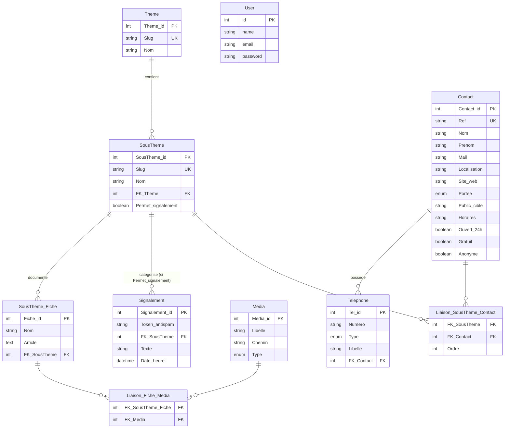
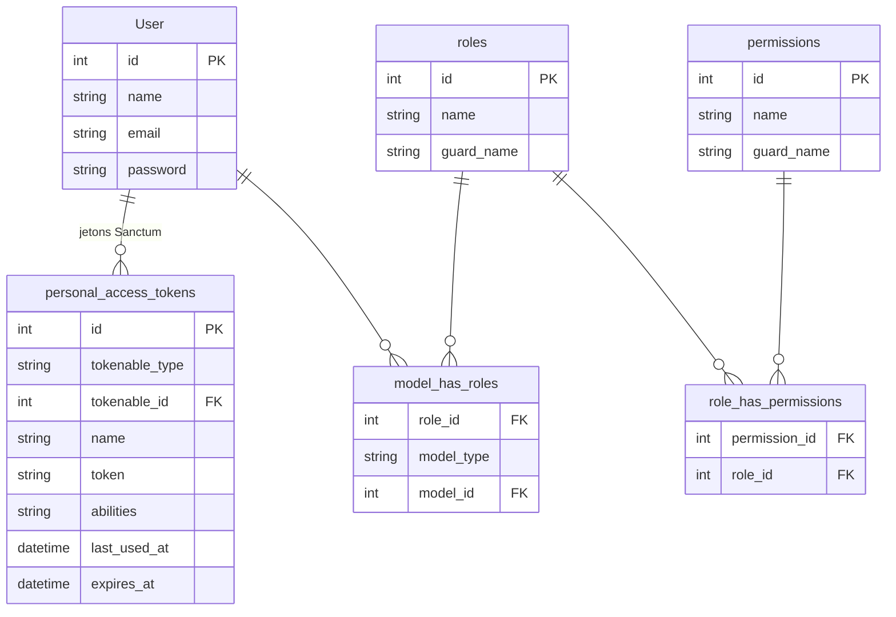

# Schéma de Base de Données — Safe Campus

## Navigation du site

`Thème → SousTheme → contacts du sous-thème.`

Un contact n'existe jamais seul : il est rattaché à un ou plusieurs sous-thèmes via
`Liaison_SousTheme_Contact`. 27 contacts sur 38 sont multi-thématiques (moyenne 2,24).
`Signalement` se rattache également à `SousTheme` — les deux chemins sont cohérents.

`SousTheme_Fiche` porte le contenu éditorial (`Nom`, `Article`) et n'intervient plus dans le chemin
des contacts.

---

## Sprint 1 — Thèmes, Contacts, Signalements & Admin



---

## Infrastructure auth — Sanctum & Filament Shield / Spatie (tables auto-générées)



---

## Sprint 2 — Histoires & Scènes

> `Theme`, `SousTheme`, `User` et `Media` sont définis dans le Sprint 1.


---

## Taxonomie

4 thèmes, 9 sous-thèmes. Chacun est couvert par au moins un contact de l'annuaire NC.

| Thème | Sous-thèmes |
|---|---|
| `sante_mentale` | `detresse_psychologique`, `crise_suicidaire` |
| `addictions` | `alcool`, `cannabis_stupefiants`, `tabac`, `jeux_ecrans` |
| `vss` | `violences_sexuelles`, `violences_intrafamiliales` |
| `transverse` | `urgences` |

Les contacts d'urgence transverses (SAMU 15, Police 17, Pompiers 18) sont rattachés au sous-thème
`urgences`. Pas de booléen `Affichage_permanent` sur `Contact` : deux mécanismes concurrents pour le
même besoin créeraient de l'ambiguïté. Réversible si l'affichage en tête de chaque fiche s'impose.

---

## Contrôle d'accès — Filament Shield

Un seul panel `/admin`. Filament Shield (plugin Spatie × Filament) génère automatiquement une
permission par action et par ressource :

```
view_contact   create_contact   update_contact   delete_contact
view_histoire  create_histoire  update_histoire  delete_histoire
...
```

Deux rôles métier prévus :

| Ressource Filament | `webmaster` | `redacteur` |
|---|---|---|
| Thèmes / Sous-thèmes | ✓ | ✗ |
| Contacts / Téléphones | ✓ | ✗ |
| Médias | ✓ | ✓ |
| Signalements | ✓ | ✗ |
| Histoires / Scènes / Choix | ✗ | ✓ |

Un rédacteur qui tente `/admin/contacts` reçoit un 403. Le menu Filament masque automatiquement les
ressources inaccessibles. Même table `users` pour les deux rôles.

Sanctum et Filament cohabitent. Sanctum authentifie les utilisateurs et délivre des jetons d'API. Il
ne gouverne pas l'accès au panel. L'accès à `/admin` se décide par `canAccessPanel()` sur le modèle
`User` :

```php
use Filament\Models\Contracts\FilamentUser;
use Filament\Panel;

class User extends Authenticatable implements FilamentUser
{
    use HasApiTokens, HasRoles;   // Sanctum + Spatie

    public function canAccessPanel(Panel $panel): bool
    {
        return $this->hasAnyRole(['webmaster', 'redacteur']);
    }
}
```

Un utilisateur Sanctum sans rôle est authentifié mais reçoit un 403 sur `/admin`. Filament ouvre une
session sur le guard `web` ; Sanctum utilise le guard `sanctum`. Aucun conflit.

---

## Correspondance MCD → Laravel

Le diagramme est conceptuel. L'implémentation suit les conventions Laravel : tables au pluriel en
`snake_case`, PK `id`, FK `<entite>_id`, pivots nommés par ordre alphabétique des deux modèles.

| Entité MCD | Table Laravel |
|---|---|
| `Theme` | `themes` |
| `SousTheme` | `sous_themes` |
| `SousTheme_Fiche` | `fiches` |
| `Contact` | `contacts` |
| `Telephone` | `telephones` |
| `Media` | `medias` |
| `Signalement` | `signalements` |
| `Liaison_SousTheme_Contact` | `contact_sous_theme` |
| `Liaison_Fiche_Media` | `fiche_media` |

Les deux tables pivot ont une clé primaire composite sur leurs deux FK.

---

## Notes techniques

### Enums

Déclarés dans `app/Enums`, castés via `$casts` sur les modèles.

| Enum | Valeurs |
|---|---|
| `Telephone.Type` | `mobile`, `fixe`, `sms`, `urgence` |
| `Media.Type` | `image`, `video`, `audio`, `document` |
| `Contact.Portee` | `territoire`, `sud`, `nord`, `iles` |
| `Histoire.Etat` | `brouillon`, `relecture`, `validé`, `publié` |

### Contact

- **Ref** : slug stable issu de l'annuaire, clé de dédoublonnage du seeder. Rend le réimport
  idempotent.
- **Nom / Prenom** : la majorité des contacts sont des structures, `Prenom` y reste vide. Le champ
  est conservé pour les **référents nommés** à venir. Prudence sur les agents dont la rotation
  rendrait la fiche fausse — préférer la fonction quand c'est le poste, et non la personne, qui est
  le contact.
- **Portee** : un étudiant à Lifou ne doit pas voir le CMP Galliéni en tête.
- **Public_cible** : DECLIC est réservé aux moins de 25 ans, le CSAPA aux plus de 25 ans, SOS
  Violences est agréé mineurs. Une mauvaise orientation aboutit à un refus de prise en charge.
- **Horaires / Ouvert_24h** : SOS Écoute ferme à 1h, le CSAPA à 17h, le SAMU jamais. Un étudiant qui
  cherche de l'aide à 2h doit savoir ce qui est joignable.
- **Gratuit / Anonyme** : critères filtrables, décisifs avant de composer un numéro.
- **Site_web** : présent sur 5+ contacts (`arretonslesviolences.gouv.fr`, `dignity-asso.com`,
  `violencesconjugales.gouv.nc`…).

> `Public_cible`, `Horaires`, `Ouvert_24h`, `Gratuit`, `Anonyme` et `Site_web` sont créés *nullable*
> et restent à remplir : l'extraction actuelle ne les porte pas. Créer la colonne coûte peu, la
> réextraction de l'annuaire est différable. `Portee` figurait dans la première extraction et est
> récupérable par jointure sur `Ref`.

### Telephone

- **Libelle** : distingue plusieurs numéros d'une même structure — le commissariat de Nouméa a une
  ligne psychologue et une ligne intervenant social. Sans ce champ il faut dupliquer le contact.

### Liaison_SousTheme_Contact

Relation N-N : un contact sert plusieurs sous-thèmes, un sous-thème expose plusieurs contacts.
Remplace `Liaison_Fiche_Contact`.

- **Ordre** : priorité d'affichage dans une fiche. Sur `detresse_psychologique`, le 15 passe avant le
  reste. Sans ce champ l'affichage suit l'ordre d'insertion.

### SousTheme_Fiche

Conservée comme table distincte plutôt que fusionnée dans `SousTheme`. Le schéma autorise plusieurs
fiches par sous-thème ; la fusion fermerait cette porte pour économiser une table.

### Signalement

Module **reporté**. La table reste au schéma en l'état. Deux points à trancher avant implémentation :

- un champ d'état (`nouveau`, `en_cours`, `traite`, `archive`) — sans lui, impossible de distinguer
  en back-office un signalement neuf d'un signalement traité ;
- la cible de routage, qui reçoit le signalement — question ouverte côté DNSI.

Invariants déjà actés : `Token_antispam` est un token libre (fingerprint, cookie, IP hashée) destiné
à limiter le spam, sans aucune FK vers `User`. Seuls les `SousTheme` avec `Permet_signalement = true`
exposent le formulaire.

### Divers

- **Table `users`** : nommage Laravel (`id`, `name`, `email`, `password`). Filament attend `email` et
  `password` sur son écran de connexion ; Laravel lit `$this->password` via `getAuthPassword()`.
- **Bifurcation thématique** : `Scene.FK_SousTheme` peut différer de `Histoire.FK_SousTheme`,
  permettant à un choix de basculer le récit vers une autre thématique (ex. alcool → cannabis).
- **Choix** : navigation orientée vers l'avant uniquement. `FK_Prev_Scene` supprimé — le précédent se
  retrouve par le graphe des choix entrants.
- **Timestamps** (`created_at`, `updated_at`) : gérés automatiquement par les migrations Laravel.
- **Sanctum** : `personal_access_tokens` est publié via `php artisan vendor:publish`. Ne pas modifier
  manuellement.
- **Filament Shield** : permissions générées via `php artisan shield:generate`. Les tables Spatie
  (`roles`, `permissions`, `model_has_roles`, `role_has_permissions`) sont migrées par le package.

---

## Périmètre des données

Nouvelle-Calédonie uniquement. Les six lignes métropolitaines de l'annuaire source (Alcool Info
Service, Drogues Info Service, Écoute Cannabis, Fil Santé Jeunes, Tabac Info Service, Joueurs Info
Service) sont écartées — l'annuaire demandait lui-même d'en vérifier la disponibilité auprès de
l'OPT.

Deux exceptions conservées, **à valider** : le `3114` (prévention du suicide), que l'annuaire déclare
explicitement accessible depuis la NC, et `arretonslesviolences.gouv.fr`, portail web sans numéro.

---

## Backlog schéma — non tranché

- **Signalement** : état et cible de routage (voir plus haut). Module reporté.
- **Granularité de la taxonomie** : `tabac` et `jeux_ecrans` n'ont que 3 contacts chacun, tous
  génériques. Fusion possible en `autres_addictions`.
- **Remplissage des champs Contact nullable** : nécessite une réextraction de l'annuaire source pour
  `Public_cible`, `Horaires`, `Ouvert_24h`, `Gratuit`, `Anonyme`, `Site_web`.
- **Emplacement de `contact.csv`** : versionné, mais sous `public/data/` — donc servi par le web. À
  déplacer sous `database/seeders/data/` avant l'écriture du seeder : ce fichier est une source de
  seed, pas un asset public.

---

## Écarts vs la version initiale du schéma

| Point | Avant | Après |
|---|---|---|
| Liaison contact | `Liaison_Fiche_Contact` (via `SousTheme_Fiche`) | `Liaison_SousTheme_Contact` (directe) + `Ordre` |
| `Contact` | Nom, Prenom, Mail, Localisation | + Ref, Site_web, Portee, Public_cible, Horaires, Ouvert_24h, Gratuit, Anonyme |
| `Telephone` | Numero, Type | + Libelle |
| `Theme` / `SousTheme` | Nom | + Slug (clé stable pour le seeder) |
| `User` | `User_log` / `User_mpd` | `id`, `name`, `email`, `password` |
| `Signalement` | — | Module reporté, état et routage à trancher |
