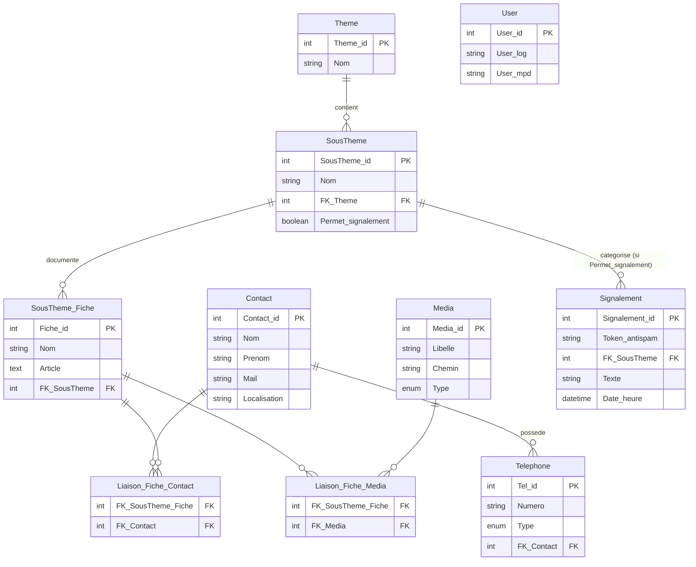
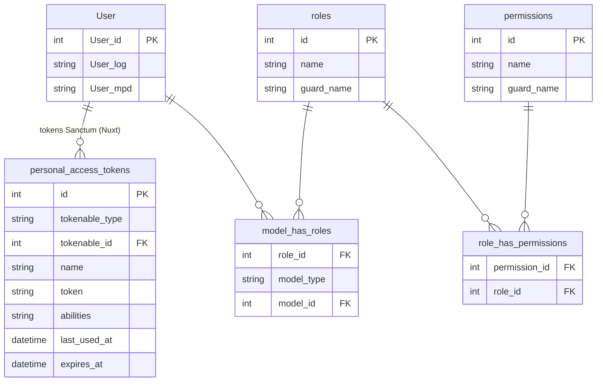
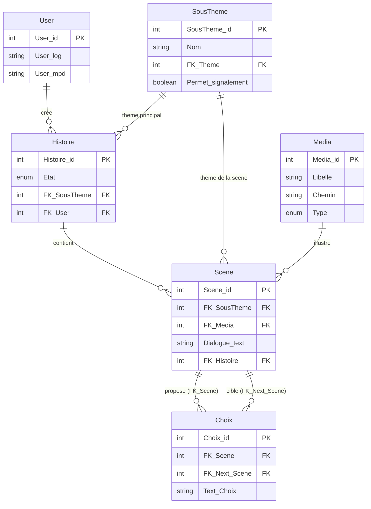

# Schéma de Base de Données — Safe Campus

## Sprint 1 — Thèmes, Contacts, Signalements & Admin



### Infrastructure auth — Sanctum & Filament Shield / Spatie (tables auto-générées)



---

## Sprint 2 — Histoires & Scènes

> `Theme`, `SousTheme`, `User` et `Media` sont définis dans le Sprint 1.



---

## Contrôle d'accès — Filament Shield

Un seul panel `/admin`. Filament Shield (plugin Spatie × Filament) génère automatiquement une permission par action et par ressource :

```
view_contact   create_contact   update_contact   delete_contact
view_histoire  create_histoire  update_histoire  delete_histoire
...
```

Deux rôles métier prévus :

| Ressource Filament | `webmaster` | `redacteur` |
|---|---|---|
| Thèmes / Sous-thèmes | ✓ | ✗ |
| Contacts / Téléphones | ✓ | ✗ |
| Médias | ✓ | ✓ |
| Signalements | ✓ | ✗ |
| Histoires / Scènes / Choix | ✗ | ✓ |

Un rédacteur qui tente `/admin/contacts` reçoit un 403. Le menu Filament masque automatiquement les ressources inaccessibles.

Même table `User` pour les deux rôles. L'authentification Filament passe par une session Laravel classique — Sanctum n'est pas impliqué pour `/admin`.

---

## Notes techniques

- **Telephone.Type** : enum `mobile`, `fixe`, `sms`, `urgence`.
- **Media.Type** : enum `image`, `video`, `audio`, `document`.
- **Histoire.Etat** : enum `brouillon`, `relecture`, `validé`, `publié`.
- **Signalement anonyme** : `Token_antispam` est un token libre (fingerprint, cookie, IP hashée) pour limiter le spam. Aucune FK vers `User`.
- **Sous-thèmes éligibles** : seuls les `SousTheme` avec `Permet_signalement = true` exposent le formulaire.
- **Bifurcation thématique** : `Scene.FK_SousTheme` peut différer de `Histoire.FK_SousTheme`, permettant à un choix de basculer le récit vers une autre thématique (ex. alcool → cannabis).
- **Choix** : navigation orientée vers l'avant uniquement. `FK_Prev_Scene` supprimé — le précédent se retrouve par le graphe des choix entrants.
- **Timestamps** (`created_at`, `updated_at`) : gérés automatiquement par les migrations Laravel.
- **Sanctum** : `personal_access_tokens` est publié via `php artisan vendor:publish`. Ne pas modifier manuellement.
- **Filament Shield** : permissions générées via `php artisan shield:generate`. Les tables Spatie (`roles`, `permissions`, `model_has_roles`, `role_has_permissions`) sont migrées par le package.
