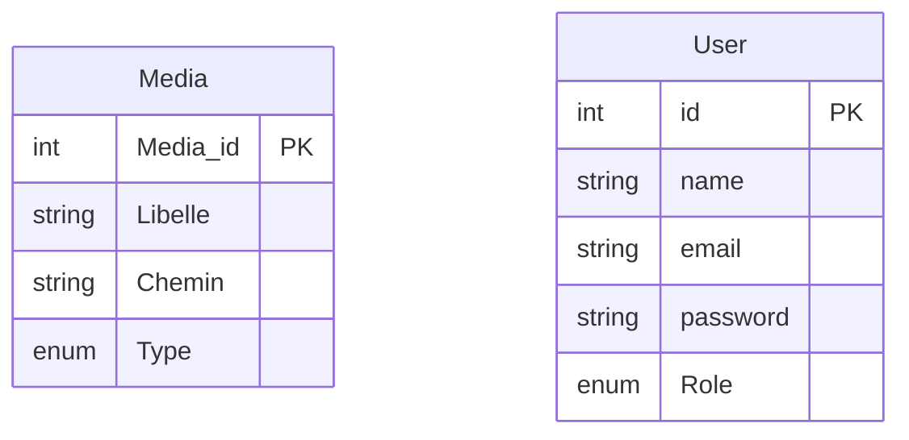
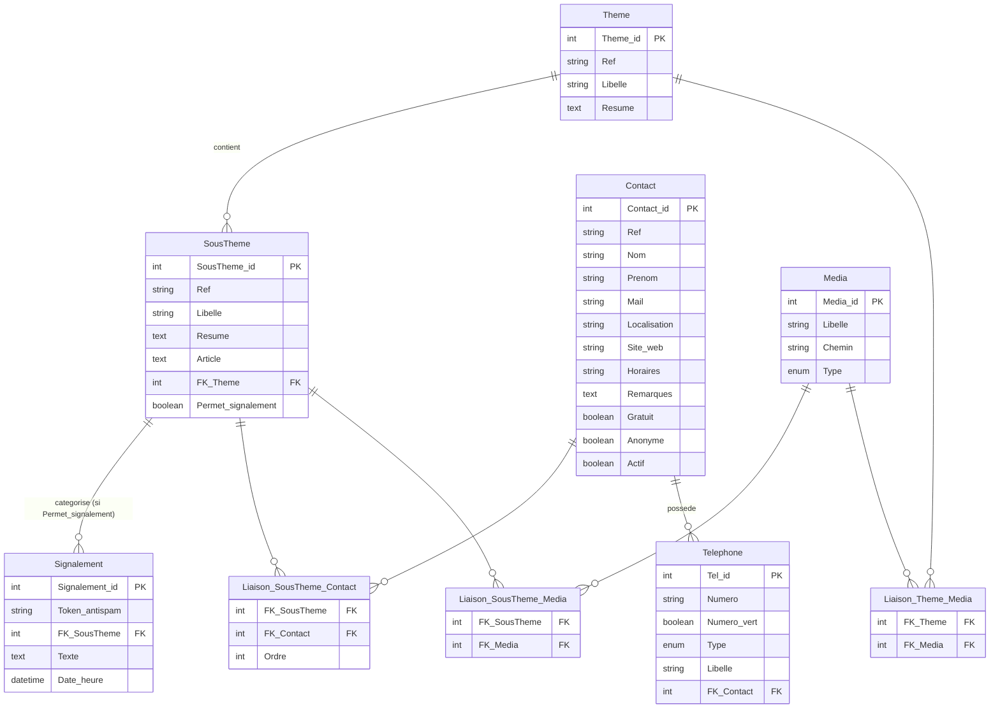
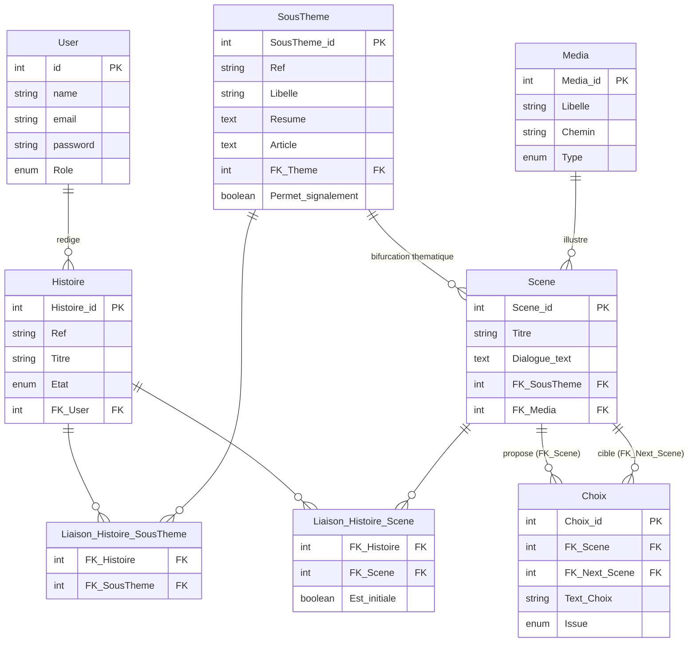
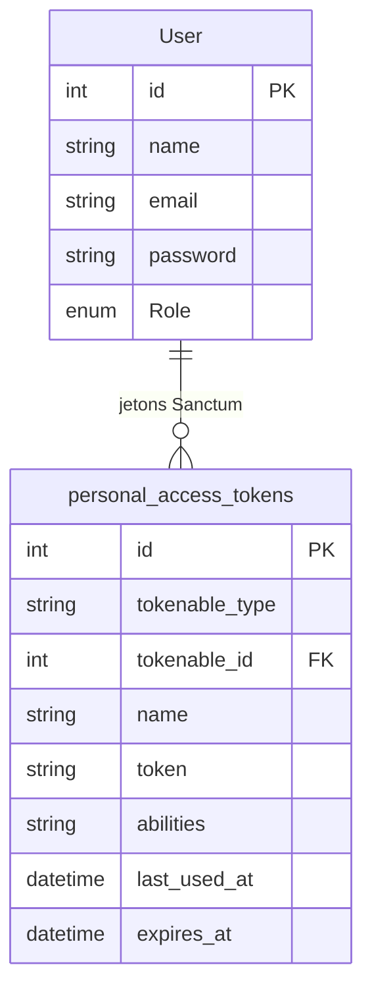

# Schéma de base de données — Safe Campus

> **État : cible.** Aucune de ces tables n'est encore migrée. `database/migrations/` ne contient
> que `users`, `cache`, `jobs` et `personal_access_tokens`. Ce document décrit ce qu'il faut
> construire, pas ce qui existe.

Le schéma est découpé en trois domaines indépendants. Ils ne partagent que le socle commun et la
taxonomie.

| Domaine | Rôle | Consommation front |
|---|---|---|
| **Annuaire** | Fiches thématiques et contacts d'aide | Contenu informatif statique, lecture publique sans authentification |
| **Histoires** | Parcours narratifs à embranchements | Application interactive |
| **Administration** | Comptes, jetons, rôles | Panel Filament `/admin` uniquement |

---

## Principes

- Le schéma prime sur les données. Les sources d'import (CSV, extractions) s'adaptent au schéma,
  jamais l'inverse.
- Une table par entité métier réelle. Pas de fusion d'entités distinctes pour économiser une table,
  pas d'éclatement d'une entité unique.
- Deux champs de nommage sur les entités de référence. `Ref` est la clé stable — jamais affichée,
  jamais modifiée, sert au seeder et aux URL. Le texte affiché est modifiable librement par un
  rédacteur : il s'appelle `Libelle` sur `Theme`, `SousTheme`, `Media` et `Telephone`, `Nom` sur
  `Contact` (c'est la raison sociale de la structure), `Titre` sur `Histoire`.
- Tout tri d'affichage purement cosmétique est traité en front. La base ne porte un `Ordre` que
  lorsque la priorité est une donnée éditoriale décidée par un rédacteur.
- Le diagramme est conceptuel. L'implémentation suit les conventions Laravel — voir
  [Correspondance MCD → Laravel](#correspondance-mcd--laravel).

Les contraintes d'unicité ne sont pas notées dans les diagrammes. Elles sont listées dans
[Contraintes d'unicité](#contraintes-dunicité).

---

## Socle commun

Deux entités partagées entre plusieurs domaines. `Media` sert l'annuaire et les histoires. `User`
sert les histoires (auteur) et l'administration.



### Media

`Libelle` est **obligatoire** et sert de clé de recherche. C'est le seul moyen de retrouver un
fichier dans la bibliothèque pour l'insérer dans un article de fiche ou le poser en fond de scène.
Sans lui, l'administrateur navigue dans une liste de chemins de fichiers.

`Chemin` est le chemin de stockage, `Type` le format (voir [Enums](#enums)).

`Media` est rattaché aux `SousTheme` par une table de liaison N-N et aux `Scene` par une FK directe.
Les deux usages diffèrent : une illustration de fiche est mutualisable entre plusieurs fiches, une
vignette de scène est propre à sa scène.

### User

Compte applicatif, créé et géré par Filament/Laravel. Voir
[Administration](#domaine-c--administration--accès).

> **Invariant : `User` et `Contact` sont deux tables sans aucun lien.** Une personne référencée dans
> l'annuaire n'a pas de compte du fait de sa présence dans l'annuaire. Si elle doit administrer le
> site, elle obtient un compte `User` créé indépendamment. Aucune FK, aucune jointure, aucun champ
> partagé entre les deux tables.

---

## Domaine A — Annuaire

Front informatif statique. Aucune authentification côté public.

### Navigation

```
Thème → Sous-thème (= la fiche) → contacts du sous-thème
```

**Le sous-thème est la fiche.** `alcool` est le nœud de taxonomie et la page qui parle d'alcool.
Une seule entité, une seule table : `SousTheme` porte `Libelle` (le titre affiché) et `Article`
(le contenu de la fiche).

Un sous-thème expose **plusieurs** contacts via `Liaison_SousTheme_Contact` et **plusieurs** médias
via `Liaison_SousTheme_Media`. `Signalement` se rattache lui aussi au sous-thème.

Un contact peut exister sans aucun sous-thème rattaché : c'est l'état normal entre sa création et
son assignation. Il est alors invisible du front. Côté Filament, le formulaire de création écrit la
ligne `Contact` d'abord, les liaisons ensuite, via un champ de relation multiple. Rien n'oblige à
les renseigner dans la même transaction.

### Diagramme



### Theme

`Resume` est un texte court optionnel, présentation du thème sur l'accueil. Associé à `Liaison_Theme_Media`
(N-N, comme `Liaison_SousTheme_Media`) : 0 à N `Media` par thème (texte, image, vidéo, logo — non
exclusifs entre eux). Le front pioche ce qu'il affiche dans cette collection en filtrant par `Type`.

Pas de table dédiée pour cette présentation : `Theme` reste l'entité, `Resume` et la relation `Media`
sont des attributs qui l'enrichissent, pas une entité séparée — même logique que `SousTheme.Resume`.

### SousTheme

Nœud de taxonomie **et** page éditoriale. La fiche alcool, c'est la ligne `alcool`.

| Champ | Rôle |
|---|---|
| `Ref` | Clé stable — seeder, URL. Jamais affichée, jamais modifiée. |
| `Libelle` | Titre affiché de la fiche et libellé dans le menu. |
| `Resume` | Teaser affiché sur la carte d'accueil. Distinct d'`Article` : payload différent, endpoint différent — voir [Consommation API](#consommation-api). |
| `Article` | Contenu éditorial complet de la fiche, affiché sur la page détail du sous-thème. |
| `FK_Theme` | Thème parent. |
| `Permet_signalement` | Expose ou non le formulaire de signalement — voir plus bas. |

Une seule table, donc une seule ressource Filament et un seul jeu de droits. Ni fiche orpheline, ni
sous-thème sans fiche : les deux cas sont impossibles par construction.

### Consommation API

Deux endpoints publics, deux payloads distincts — pas de sur-fetch :

- `GET /api/themes` — `Theme` (`ref`, `libelle`, `resume`, `medias`) avec ses `SousTheme` imbriqués
  en version légère (`ref`, `libelle`, `resume` — pas d'`article`, pas de `contacts`). Alimente les
  sections et les cartes de la page d'accueil.
- `GET /api/sous-themes/{ref}` — un seul sous-thème : `ref`, `libelle`, `article`, `contacts`
  (triés `Ordre`, filtrés `Actif`) et leurs `Telephone`. Alimente la page détail. Pas de `resume` :
  inutilisé à cet endroit.

`Article` n'est donc jamais renvoyé par `/api/themes`, `Resume` jamais par `/api/sous-themes/{ref}`.

### Contact

| Champ | Rôle |
|---|---|
| `Ref` | Clé stable, clé de dédoublonnage du seeder. Rend le réimport idempotent. |
| `Nom` / `Prenom` | La majorité des contacts sont des structures, `Prenom` y reste vide. Conservé pour les référents nommés à venir. |
| `Localisation` | Adresse ou lieu de permanence. Alimente la carte du front. |
| `Site_web` | URL de la structure. Colonne dédiée : une URL n'est pas une localisation. |
| `Horaires` | Plage d'ouverture, texte libre. SOS Écoute ferme à 1 h, le CSAPA à 17 h, le SAMU jamais. Un étudiant qui cherche de l'aide à 2 h doit savoir ce qui est joignable. |
| `Remarques` | Conditions d'accueil et restrictions de public. C'est ici que se note « DECLIC réservé aux moins de 25 ans », « CSAPA aux plus de 25 ans », « SOS Violences agréé mineurs ». Une mauvaise orientation aboutit à un refus de prise en charge. |
| `Gratuit` / `Anonyme` | Critères filtrables, décisifs avant de composer un numéro. |
| `Actif` | Cycle de vie éditorial — voir ci-dessous. |

**Pas de booléen `Ouvert_24h`.** Il ferait doublon avec `Horaires`. Le front met en valeur les
contacts joignables en continu à partir du texte des horaires.

**Pourquoi un seul champ libre.** `Remarques` couvre à la fois le public visé et les modalités
d'accueil. Un second champ « description » ferait doublon : le sous-thème dit déjà *sur quoi* porte
la structure, `Remarques` dit *à qui elle s'adresse et comment on y accède*. Deux champs libres au
rôle voisin finissent remplis à moitié chacun.

**`Actif` et suppression.** Une structure qui ferme passe à `Actif = false` : elle disparaît du front
sans casser l'historique ni les liaisons. La suppression définitive de la ligne reste possible et
doit l'être — `Nom`, `Prenom` et `Mail` d'un référent nommé sont des données personnelles, un droit
à l'effacement RGPD s'applique. Le `DELETE` doit donc cascader sur `Telephone` et sur
`Liaison_SousTheme_Contact`. Les deux mécanismes ne sont pas concurrents : `Actif` gère l'éditorial,
le `DELETE` gère le juridique.

**Aucune notion de portée géographique.** Tous les contacts d'un sous-thème sont visibles par tout
le public. Le front propose une carte interactive pour repérer le contact le plus proche. La base
n'arbitre pas la géographie.

### Telephone

`Libelle` distingue plusieurs numéros d'une même structure — le commissariat de Nouméa a une ligne
psychologue et une ligne intervenant social. Sans ce champ, il faut dupliquer le contact.

`Numero_vert` signale un numéro gratuit depuis un poste fixe (0800...). Booléen `false` par défaut,
non nullable : contrairement à `Gratuit`/`Anonyme` sur `Contact`, c'est une propriété du numéro
lui-même, toujours connue au moment de la saisie — pas de statut « inconnu » à représenter.

### Liaison_SousTheme_Contact

Relation N-N : un contact sert plusieurs sous-thèmes, un sous-thème expose plusieurs contacts, sans
limite de nombre.

`Ordre` est une **priorité éditoriale**, pas un tri cosmétique. Règle : les contacts universitaires
passent en tête, le reste suit. Sans ce champ l'affichage suit l'ordre d'insertion, c'est-à-dire
l'ordre du fichier d'import.

### Signalement

Module **reporté**. La table reste au schéma en l'état.

Le signalement n'est **pas** ouvert sur tous les sous-thèmes. `Permet_signalement` est un drapeau
par sous-thème : il vaut `true` sur un ou deux sous-thèmes au démarrage, là où le besoin est
identifié. La généralisation à toute la taxonomie se fait plus tard en basculant le drapeau, sans
migration ni changement de schéma. C'est la raison d'être du drapeau plutôt que d'une règle codée
en dur.

Autre invariant acté : `Token_antispam` est un token libre (empreinte, cookie, IP hachée) destiné à
limiter le spam. Aucune FK vers `User` : le signalement est anonyme par construction.

Non tranché : champ d'état et cible de routage. Voir [Points à trancher](#points-à-trancher).

---

## Domaine B — Histoires

Parcours interactif de type « livre dont vous êtes le héros ». Sans rapport avec le contenu
informatif du domaine A, hormis deux points de contact : la taxonomie des sous-thèmes, et les
contacts affichés en fin de parcours.

### Structure narrative

Une histoire est un graphe de scènes. Chaque scène propose plusieurs choix. Un choix mène soit à
une scène suivante, soit à la sortie du parcours.

Deux sorties possibles :

- **Sortie favorable** — le bon choix. Le parcours s'arrête, l'étudiant a identifié la bonne
  conduite.
- **Sortie défavorable** — le mauvais choix de la scène finale. Le parcours s'arrête et affiche les
  contacts correspondant à la thématique de l'histoire.

### Diagramme



### Histoire

`Titre` et `Ref` sont obligatoires. Sans eux l'histoire n'est ni listable en back-office ni
adressable par le front.

`Etat` suit le circuit de validation éditorial : `brouillon` → `relecture` → `valide` → `publie`.

`FK_User` est l'auteur.

**Thématique.** Une histoire porte un ou plusieurs sous-thèmes, via `Liaison_Histoire_SousTheme`.
Une histoire sur l'alcool en soirée peut relever à la fois de `alcool` et de `violences_sexuelles`.

### Scene et partage entre histoires

**Une scène peut appartenir à plusieurs histoires.** C'est la raison d'être de
`Liaison_Histoire_Scene` : une scène d'introduction ou une étape générique se réutilise d'un arbre à
l'autre sans duplication de contenu.

`Est_initiale` est porté par la **liaison**, pas par la scène. Une scène partagée peut être le point
d'entrée d'une histoire et une étape intermédiaire d'une autre — un booléen sur `Scene` ne saurait
pas le dire. Contrainte : un index unique partiel garantit **une seule** ligne `Est_initiale = true`
par histoire.

```sql
CREATE UNIQUE INDEX histoire_scene_initiale_unique
    ON histoire_scene (histoire_id) WHERE est_initiale;
```

**Invariant d'appartenance.** La liaison fait autorité sur la composition d'une histoire. Le graphe
des `Choix` doit y rester cohérent : toute scène atteignable depuis la scène initiale d'une histoire
doit être liée à cette histoire. La vérification est à faire côté application, à l'enregistrement
d'un choix. Sans cette règle, la table de liaison et le graphe peuvent diverger silencieusement.

`Scene.FK_SousTheme` est **nullable** et sert d'exception : il permet à une scène de basculer le
récit vers une autre thématique que celle de l'histoire (alcool → cannabis). Il n'est pas la source
de vérité thématique.

`Scene.FK_Media` est **nullable** : image ou fond de la scène, retrouvé par `Media.Libelle` dans le
sélecteur Filament.

`Scene.Titre` est un libellé court, à usage back-office uniquement. Il n'est pas affiché au joueur.
Sans lui, la liste des scènes et le sélecteur de `FK_Next_Scene` n'affichent que du dialogue tronqué,
et le rédacteur ne peut pas relier ses scènes entre elles. Même raison que `Media.Libelle`.

### Choix

`FK_Next_Scene` est **nullable**. `NULL` signifie sortie du parcours.

`Issue` qualifie cette sortie : `favorable` ou `defavorable`. Il reste `NULL` quand le choix
poursuit l'histoire.

**Résolution des contacts en fin de parcours.** Sur un choix `Issue = defavorable`, le front affiche
les contacts de l'histoire :

1. sous-thèmes de l'histoire via `Liaison_Histoire_SousTheme` ;
2. contacts de ces sous-thèmes via `Liaison_SousTheme_Contact`, triés par `Ordre`, filtrés sur
   `Actif = true` ;
3. si la scène porte un `FK_SousTheme`, il remplace l'étape 1 — la bifurcation prime.

L'histoire courante est toujours connue à l'exécution, la résolution reste donc déterministe même
avec des scènes partagées.

**Pas d'`Ordre` sur `Choix`.** L'ordre d'affichage des choix d'une scène est une décision de
présentation, traitée en front.

---

## Domaine C — Administration & accès

Le panel `/admin` est le seul point d'entrée authentifié. Les comptes sont créés par Filament, dans
la table `users`, indépendamment de tout contenu de l'annuaire.



### Séparation stricte User / Contact

Un intervenant listé dans l'annuaire n'est **pas** un utilisateur du site. `Contact` décrit une
ressource d'aide publiée ; `User` décrit un compte qui administre le site. Les deux tables ne
partagent ni FK, ni clé fonctionnelle, ni contrainte croisée.

Si un intervenant doit aussi administrer le site, un compte `User` lui est créé normalement via
Filament. Il existe alors deux lignes, dans deux tables, sans lien. C'est voulu : lier les deux
imposerait de gérer un cycle de vie commun entre un contenu éditorial et un compte d'accès, et de
supprimer un compte à chaque retrait d'un contact de l'annuaire.

### Rôles

Deux rôles métier, mutuellement exclusifs, portés par la colonne `Role` sur `users`.

| Ressource Filament | `webmaster` | `redacteur` |
|---|---|---|
| Thèmes / Sous-thèmes (fiches) | ✓ | ✗ |
| Contacts / Téléphones | ✓ | ✗ |
| Médias | ✓ | ✓ |
| Signalements | ✓ | ✗ |
| Histoires / Scènes / Choix | ✗ | ✓ |

L'accès au panel se décide par `canAccessPanel()` sur le modèle `User`. Le filtrage par ressource se
fait par des Policies Laravel standard, une par ressource, lues automatiquement par Filament. Un
rédacteur qui tente `/admin/contacts` reçoit un 403 et ne voit pas l'entrée dans le menu.

Un utilisateur sans rôle est authentifié mais reçoit un 403 sur `/admin`.

L'alternative — Spatie Permission + Filament Shield — est écartée pour l'instant. Comparatif au
[point 6](#sur-le-point-6).

### Sanctum

Sanctum authentifie les appels d'API et délivre des jetons. Il ne gouverne pas l'accès au panel.
Filament ouvre une session sur le guard `web`, Sanctum utilise le guard `sanctum`. Aucun conflit.

`personal_access_tokens` est publié par `php artisan vendor:publish`. Ne pas modifier la migration
à la main.

---

## Taxonomie

| Thème (`Ref`) | Sous-thèmes (`Ref`) |
|---|---|
| `sante_mentale` | `detresse_psychologique`, `crise_suicidaire` |
| `addictions` | `alcool`, `cannabis_stupefiants`, `tabac`, `jeux_ecrans` |
| `vss` | `violences_sexuelles`, `violences_intrafamiliales` |
| `transverse` | `urgences` |

Les contacts d'urgence transverses (SAMU 15, Police 17, Pompiers 18) sont rattachés au sous-thème
`urgences`. Pas de booléen `Affichage_permanent` sur `Contact` : deux mécanismes concurrents pour le
même besoin créeraient de l'ambiguïté. `Liaison_SousTheme_Contact.Ordre` suffit à les faire remonter.

---

## Périmètre des données

Nouvelle-Calédonie uniquement. Les lignes d'assistance métropolitaines de l'annuaire source sont
écartées : l'annuaire demandait lui-même d'en vérifier la disponibilité depuis la NC auprès de l'OPT.

Deux exceptions conservées, **à valider** : le `3114` (prévention du suicide), que l'annuaire déclare
explicitement accessible depuis la NC, et `arretonslesviolences.gouv.fr`, portail web sans numéro.

---

## Contraintes d'unicité

| Table | Colonne(s) | Raison |
|---|---|---|
| `themes` | `ref` | Clé stable du seeder et des URL |
| `sous_themes` | `ref` | Idem |
| `contacts` | `ref` | Clé de dédoublonnage du réimport |
| `histoires` | `ref` | Adressage par le front |
| `users` | `email` | Standard Laravel |
| `contact_sous_theme` | (`contact_id`, `sous_theme_id`) | PK composite |
| `media_sous_theme` | (`media_id`, `sous_theme_id`) | PK composite |
| `media_theme` | (`media_id`, `theme_id`) | PK composite |
| `histoire_sous_theme` | (`histoire_id`, `sous_theme_id`) | PK composite |
| `histoire_scene` | (`histoire_id`, `scene_id`) | PK composite |
| `histoire_scene` | `histoire_id` où `est_initiale` | Index partiel — une scène initiale par histoire |

---

## Correspondance MCD → Laravel

Tables au pluriel en `snake_case`, PK `id`, FK `<entite>_id`, pivots nommés par ordre alphabétique
des deux modèles.

| Entité MCD | Modèle | Table | Note |
|---|---|---|---|
| `Theme` | `Theme` | `themes` | porte aussi `resume` (teaser accueil, optionnel) |
| `SousTheme` | `SousTheme` | `sous_themes` | porte aussi `resume` (teaser accueil) et `article` (contenu de la fiche) |
| `Contact` | `Contact` | `contacts` | |
| `Telephone` | `Telephone` | `telephones` | |
| `Media` | `Media` | `medias` | **`protected $table = 'medias'`** — Laravel infère `media` |
| `Signalement` | `Signalement` | `signalements` | |
| `Histoire` | `Histoire` | `histoires` | |
| `Scene` | `Scene` | `scenes` | `titre` = libellé back-office, `dialogue_text` = contenu joué |
| `Choix` | `Choix` | `choix` | **`protected $table = 'choix'`** — Laravel infère `choixes` |
| `Liaison_SousTheme_Contact` | — | `contact_sous_theme` | pivot + colonne `ordre` |
| `Liaison_SousTheme_Media` | — | `media_sous_theme` | pivot |
| `Liaison_Theme_Media` | — | `media_theme` | pivot |
| `Liaison_Histoire_SousTheme` | — | `histoire_sous_theme` | pivot |
| `Liaison_Histoire_Scene` | — | `histoire_scene` | pivot + colonne `est_initiale` |

`Media` et `Choix` sont les deux seuls cas où l'inflecteur Laravel se trompe. Vérifié en exécutant
`Str::snake(Str::pluralStudly('Media'))` → `media` et `…('Choix')` → `choixes`. Sans `$table`
explicite, la migration crée une table que le modèle n'interroge pas.

### Index

PostgreSQL **n'indexe pas** automatiquement la colonne référençante d'une clé étrangère, contrairement
à MySQL/InnoDB. `foreignId()->constrained()` crée la contrainte, pas l'index. À déclarer
explicitement sur `sous_themes.theme_id`, `telephones.contact_id`, `signalements.sous_theme_id`,
`histoires.user_id`, `scenes.sous_theme_id`, `scenes.media_id`, `choix.scene_id`,
`choix.next_scene_id` et les deux colonnes de chaque pivot.

### Timestamps

`created_at` / `updated_at` sur toutes les tables sauf les pivots. Gérés par `$table->timestamps()`.

---

## Enums

Déclarés dans `app/Enums` (répertoire à créer), castés via `$casts` sur les modèles.

| Enum | Valeurs |
|---|---|
| `Telephone.Type` | `mobile`, `fixe`, `sms`, `urgence` |
| `Media.Type` | `image`, `video`, `audio`, `document` |
| `Histoire.Etat` | `brouillon`, `relecture`, `valide`, `publie` |
| `Choix.Issue` | `favorable`, `defavorable` — `NULL` si le choix poursuit |
| `User.Role` | `webmaster`, `redacteur` |

Valeurs sans accent ni majuscule. Elles servent de valeur stockée, de valeur de backed enum PHP et
de paramètre d'URL dans les filtres Filament. L'accentuation reste au libellé affiché.

---

## Points à trancher

| # | Question | Impact |
|---|---|---|
| 1 | **Partage de scène et sous-arbre.** Une scène partagée emporte ses `Choix`, donc tout son sous-arbre aval. Si deux histoires doivent réutiliser la même scène avec des choix différents, `Choix` a besoin d'un `FK_Histoire` et le modèle change. | Structurel, à trancher avant migration |
| 2 | **Carte du front.** Géocodage de `Localisation` à la volée, ou colonnes `Latitude` / `Longitude` stockées ? | Deux colonnes, mais un pipeline de géocodage |
| 3 | **Horaires structurés.** `Horaires` texte libre suffit pour l'affichage. Si le front doit calculer « ouvert maintenant », il faut une table `Plage_horaire` (`FK_Contact`, jour, heure début, heure fin). | Une table |
| 4 | **Contrainte `Choix.Issue`.** Poser un CHECK `Issue IS NOT NULL ⟺ FK_Next_Scene IS NULL` ? Interdit les états incohérents, fige la règle métier. | Une contrainte |
| 5 | **Signalement.** Champ d'état (`nouveau`, `en_cours`, `traite`, `archive`) et cible de routage. Question ouverte côté DNSI. | Bloquant pour le module |
| 6 | **Gestion des rôles.** Colonne `Role` + Policies, ou Spatie Permission + Filament Shield. | Voir ci-dessous |
| 7 | **Emplacement de `contact.csv`.** Versionné sous `public/data/` — donc servi en HTTP. À déplacer sous `database/seeders/data/` avant l'écriture du seeder. | À faire, pas à arbitrer |

### Sur le point 6

`spatie/laravel-permission` stocke rôles et permissions en base (`roles`, `permissions`,
`model_has_roles`, `role_has_permissions`). `bezhansalleh/filament-shield` est un plugin qui s'appuie
dessus et génère automatiquement une permission par action et par ressource Filament
(`view_contact`, `create_contact`, `update_contact`, `delete_contact`…), plus un écran
d'administration pour les cocher.

Ni l'un ni l'autre n'est installé.

| | Colonne `Role` + Policies | Spatie + Shield |
|---|---|---|
| Dépendances | 0 | 2 packages, 4 tables |
| Rôles modifiables sans déploiement | ✗ | ✓ |
| Granularité | rôle entier | action × ressource |
| Coût d'écriture | 1 enum, 1 policy par ressource | installation + `shield:generate` |

**Recommandation : colonne `Role`.** Deux rôles fixes, définis à l'avance, sans besoin de créer un
rôle en production. Spatie et Shield répondent à un problème que le projet n'a pas. Le passage à
Spatie reste possible plus tard sans toucher au reste du schéma : il ajoute des tables, il n'en
modifie aucune.

